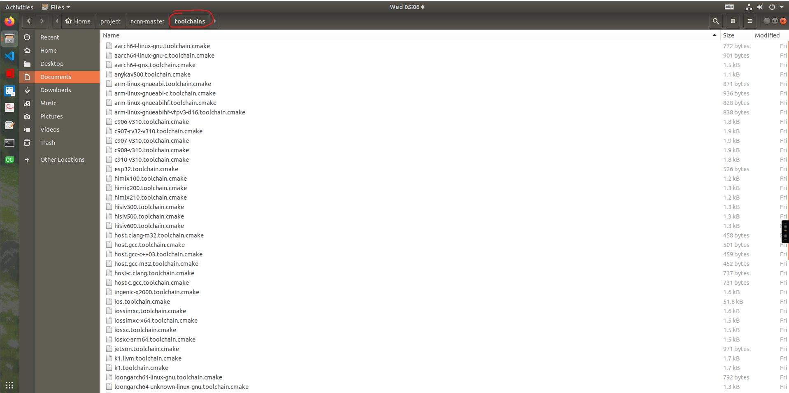
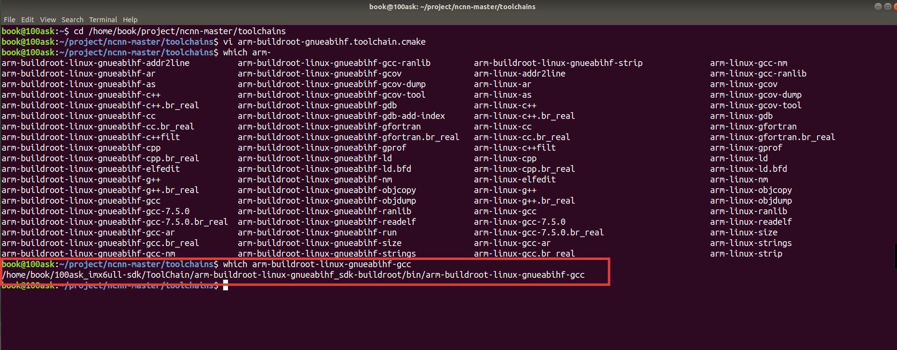

# i.MX6ULL NCNN环境搭建与移植

---
## 流程：
```
PC 上执行 cmake
    ↓
读取这个工具链文件
    ↓
知道目标平台是 ARM Linux
    ↓
使用 ARM 交叉编译器
    ↓
编译时只找 ARM 的库和头文件
    ↓
生成针对 ARM Cortex-A7 优化的代码
    ↓
编译出可在 i.MX6ULL 上运行的程序
```
---
## 一、下载NCNN的框架包于PC中
```angular2html
# 首先拉取 NCNN 代码：
https://github.com/Tencent/ncnn
unzip ncnn-master.zip 

# 安装相关依赖：
sudo apt update
sudo apt install build-essential git cmake libprotobuf-dev protobuf-compiler libvulkan-dev vulkan-utils libopencv-dev
```
## 二、调用交叉编译工具链部署 NCNN 框架

**100ASK-6ULL-V11 开发板添加cmake配置(该开发板芯片为imx6ull)**
执行命令
```angular2html
# ncnn-master 就是 git 拉下来的文件夹
cd ./ncnn-master/toolchains
```
在toolchains目录下，我们可以看到很多其它开发板的编译配置文件 ：


参照其它开发板的配置文件，为 100ASK-6ULL-V11 开发板添加配置文件arm-buildroot-gnueabihf.toolchain.cmake：
### 终端打开此页面，执行下述命令:
```angular2html
# vi 是 Linux 的文本编辑器
# 这会创建一个名为 arm-buildroot-gnueabihf.toolchain.cmake 的文件, 并打开

vi arm-buildroot-gnueabihf.toolchain.cmake
```

### 执行之后自动进入该文件，复制粘贴如下make代码:

```cmake
set(CMAKE_SYSTEM_NAME Linux)
set(CMAKE_SYSTEM_PROCESSOR arm)

set(CMAKE_C_COMPILER "arm-buildroot-linux-gnueabihf-gcc")
set(CMAKE_CXX_COMPILER "arm-buildroot-linux-gnueabihf-g++")

set(CMAKE_FIND_ROOT_PATH_MODE_PROGRAM NEVER)
set(CMAKE_FIND_ROOT_PATH_MODE_LIBRARY ONLY)
set(CMAKE_FIND_ROOT_PATH_MODE_INCLUDE ONLY)

set(CMAKE_C_FLAGS "-march=armv7-a -mfloat-abi=hard -mfpu=neon")
set(CMAKE_CXX_FLAGS "-march=armv7-a -mfloat-abi=hard -mfpu=neon")

# cache flags
set(CMAKE_C_FLAGS "${CMAKE_C_FLAGS}" CACHE STRING "c flags")
set(CMAKE_CXX_FLAGS "${CMAKE_CXX_FLAGS}" CACHE STRING "c++ flags")
```
代码解释
```text

1. 基本系统设置
set(CMAKE_SYSTEM_NAME Linux)      # 目标系统是 Linux
set(CMAKE_SYSTEM_PROCESSOR arm)   # 目标处理器是 ARM 架构
# 告诉 CMake，编译出来的程序要在 ARM 架构的 Linux 系统上运行，不是在当前 PC（x86）上运行。

2. 指定交叉编译器
set(CMAKE_C_COMPILER "arm-buildroot-linux-gnueabihf-gcc")    # C 编译器
set(CMAKE_CXX_COMPILER "arm-buildroot-linux-gnueabihf-g++")  # C++ 编译器
# 作用：指定使用 ARM 交叉编译器，而不是 PC 自带的 gcc/g++。

3. 文件查找规则
set(CMAKE_FIND_ROOT_PATH_MODE_PROGRAM NEVER)  # 程序查找：编译过程中需要运行的工具（如编译器本身）用 PC 的，不用 ARM 的
set(CMAKE_FIND_ROOT_PATH_MODE_LIBRARY ONLY)   # 库文件：要链接的库文件（如 .so、.a）只用 ARM 的
set(CMAKE_FIND_ROOT_PATH_MODE_INCLUDE ONLY)   # 头文件：头文件只用 ARM 的
# 作用：防止编译时混用 PC 和 ARM 的文件。这样可以避免链接到 PC 的库导致程序在 ARM 上无法运行

4. 编译优化选项
set(CMAKE_C_FLAGS "-march=armv7-a -mfloat-abi=hard -mfpu=neon")
set(CMAKE_CXX_FLAGS "-march=armv7-a -mfloat-abi=hard -mfpu=neon")
# 作用：针对 i.MX6ULL 的 ARM Cortex-A7 处理器进行优化。
# -march=armv7-a：   生成 ARMv7-A 架构的指令（i.MX6ULL 是 Cortex-A7，属于 ARMv7-A）
# -mfloat-abi=hard： 使用硬件浮点运算单元（FPU），加快浮点计算
# -mfpu=neon：       启用 NEON 指令集（ARM 的 SIMD 扩展），加速神经网络计算

5. 缓存设置
set(CMAKE_C_FLAGS "${CMAKE_C_FLAGS}" CACHE STRING "c flags")
set(CMAKE_CXX_FLAGS "${CMAKE_CXX_FLAGS}" CACHE STRING "c++ flags")
# 作用：将编译选项保存到 CMake 缓存中，确保整个编译过程中这些设置不会丢失。
# CACHE STRING：告诉 CMake 这是一个缓存变量
# "c flags"：缓存的描述信息
```


### 使用方式：
```cmake -DCMAKE_TOOLCHAIN_FILE=./arm-buildroot-gnueabihf.toolchain.cmake ..```

**注意，确保arm的gcc,g++编译工具已存在,如下：**

**配置交叉工具链去《1_嵌入式Linux应用开发完全手册V5.3_IMX6ULL_Pro开发板.pdf》里面找**

## 三、进行交叉编译，获得arm框架开发板(imx6ull)可使用的可执行程序和库等

在配置好 iMX6ULL 开发板所需的交叉编译工具链后，就可以使用cmake命令来生成编译所需的makefile文件了，为了方便，我们在后续编译的同时生成样例程序。
### 终端上执行命令：
```cmd
# 1. 确保在 ncnn 源码根目录
cd ~/project/ncnn-master

# 2. 创建编译目录（第一次需要）
mkdir -p build-imx6ull

# 3. 进入编译目录
cd build-imx6ull

# 4. 配置交叉编译（生成 Makefile），生成 Makefile 文件，为后续的编译做准备
cmake -DCMAKE_BUILD_TYPE=Release \
      -DNCNN_SIMPLEOCV=ON \
      -DCMAKE_TOOLCHAIN_FILE=../toolchains/arm-buildroot-gnueabihf.toolchain.cmake \
      -DNCNN_BUILD_EXAMPLES=ON \
      ..

# 5. 开始编译
make -j4

# 6. 查看结果
ls examples/  # 示例程序
ls src/       # 库文件
```
**解释“4. 配置交叉编译（生成 Makefile）”：**

下面这条 `cmake` 命令用于配置 NCNN 的交叉编译环境。各个参数的含义如下：

| 参数                                                                             | 作用                                                                                                           |
|:-------------------------------------------------------------------------------|:-------------------------------------------------------------------------------------------------------------|
| `-DCMAKE_BUILD_TYPE=Release`                                                   | **编译发布版本**。开启优化，生成的文件运行更快、体积更小；与之相对的是 `Debug` 版本（调试用，运行慢且体积大）。                                               |
| `-DNCNN_SIMPLEOCV=ON`                                                          | **启用 NCNN 自带的简易图像处理功能**。NCNN 内置了一套轻量级的图像处理接口（SimpleOCV），开启后就不需要额外安装完整的 OpenCV 框架，非常适合资源有限的嵌入式设备（如 i.MX6ULL）。 |
| `-DCMAKE_TOOLCHAIN_FILE=../toolchains/arm-buildroot-gnueabihf.toolchain.cmake` | **指定交叉编译工具链配置文件**。这个文件告诉 CMake 使用 ARM 编译器（而非 PC 的 gcc），从而生成能在 ARM 开发板上运行的可执行文件。                              |
| `-DNCNN_BUILD_EXAMPLES=ON`                                                     | **同时编译示例程序**。开启后会将 NCNN 自带的示例（如图像分类、目标检测等）一并编译，方便编译完成后直接进行功能测试。                                              |
| `..`                                                                           | **指定源码目录**。`..` 表示上一级目录，即 NCNN 源码的根目录。因为当前目录是 `build-imx6ull`，而源码在它的上一级。                                     |

## 四、环境文件
### ncnn的库为静态库，静态库的路径为：
```bash
-I ../ncnn-master/src
-I ../ncnn-master/build_imx6ull/src/
-L ../ncnn-master/build_imx6ull/src/
```
## 代码的库文件为：
```CPP
#include "layer.h"
#include "net.h"
```

## 五、跑通案例（可选）
把 `/ncnn-master/build_imx6ull/benchmark/benchncnn` 文件移动到开发板`/home/root/ncnn/`（开发板目录随意）上，同时将在开发板中的`/home/root/ncnn`目录下运行命令：
```
./benchncnn
```
